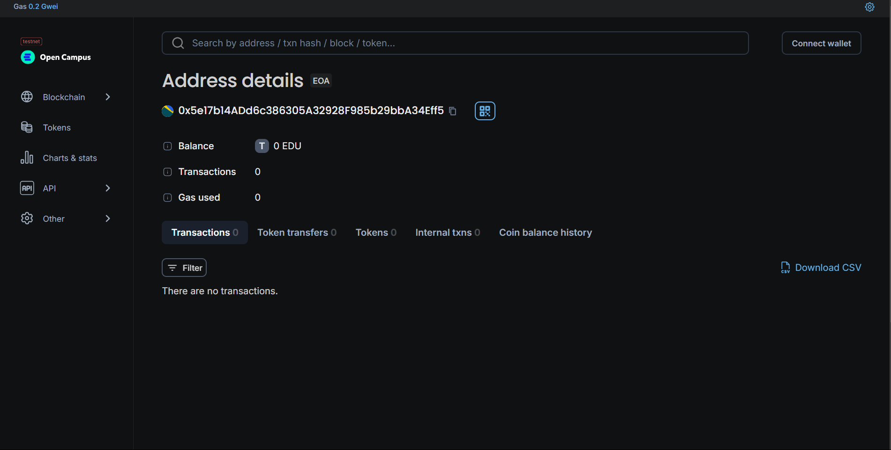

# Inter-Institute-Resource_Sharing
## Vision

The `Inter-Institute-Resource_Sharing` smart contract aims to create a decentralized platform for institutes to efficiently share resources such as books, equipment, and tools. By leveraging blockchain technology, we ensure transparency, security, and trust among participating institutions, fostering collaboration and reducing resource waste.

## Flowchart
Below is a simplified flowchart of how the `Inter-Institute-Resource_Sharing` works:
1. **Register Resource:** An institute registers a resource with a unique ID.
2. **Request Resource:** Another institute requests the registered resource.
3. **Fulfill Request:** The resource owner fulfills the request, marking it as shared.

## Features
- **Decentralized Resource Registration:** Institutes can register resources with unique IDs, names, and descriptions.
- **Transparent Requesting System:** Institutes can request resources, and the system ensures only valid requests are processed.
- **Secure Fulfillment:** Only the resource owner can fulfill requests, ensuring control over resource distribution.
- **Event Logging:** Key actions like resource registration and request fulfillment are logged on-chain for transparency.

## Future Scope
1. **Multi-Chain Deployment:** Expand the contract to other blockchain networks to increase accessibility and adoption.
2. **Automated Resource Return:** Implement functionality for automated tracking and return of resources after a specified period.
3. **Reputation System:** Introduce a reputation system for institutes based on their sharing and fulfillment activities.
4. **Resource Categorization:** Add categories and tags for resources to enhance searchability and management.

## Usage
1. **Register a Resource:** 
   - Call `registerResource("ResourceName", "ResourceDescription")`.
2. **Request a Resource:** 
   - Call `requestResource(resourceId)`.
3. **Fulfill a Request:** 
   - Call `fulfillRequest(requestId)` as the resource owner.

## Contract Address
- **Network:** Edu Chain
- **Contract Address:** 0x5e17b14ADd6c386305A32928F985b29bbA34Eff5
- **Admin:** 0x69b2Eb1Ead0982f7a20108d4659b110134A3416E   

## Contact Details
For any inquiries, feedback, or support, please reach out:
- **Name:** Hage Ankha
- **Email:** ankhahage03@gmail.com
- **GitHub: https://github.com/hagemo?tab=repositories